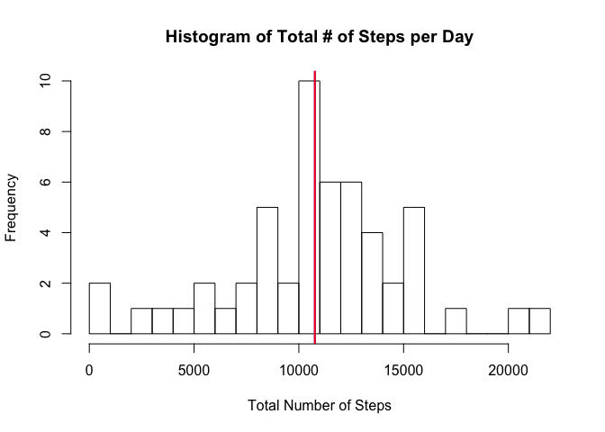
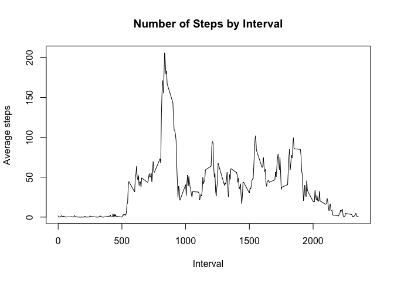
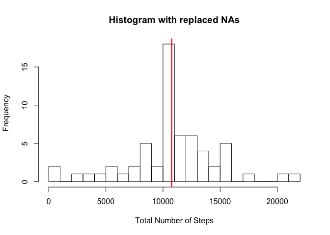
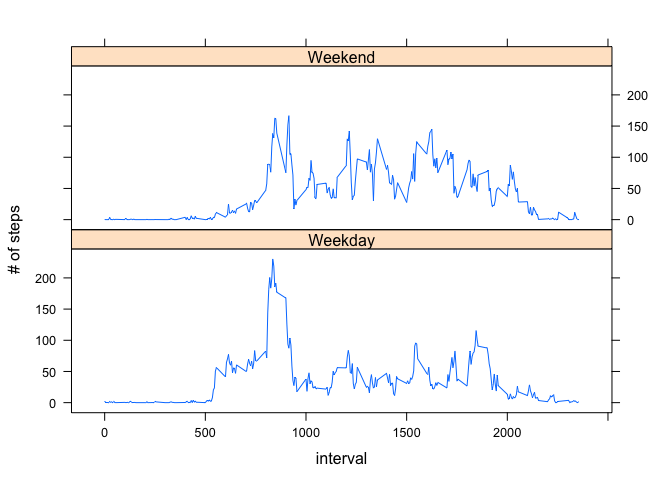

# Reproducible Research: Peer Assessment 1
#### Coursera - John Hopkins Bloomberg School of Public Health
#### Description:      Basic analysis on personal movement using activity monitoring devices.
#### Student:          Salvador J Nunez
#### Created:          2015-09-20


## Loading and preprocessing the data
First we load and transform the data.


```r
ActivityData <- read.csv("activity.csv")
ActivityData$date <- as.Date(ActivityData$date, format = "%Y-%m-%d")
```

## What is mean total number of steps taken per day?
Calculate the meaan and median and plot these values on top of the histogram. Despite having different colors, the values are close enough that they overlap.


```r
HistData <- with(ActivityData, aggregate(steps ~ date, ActivityData, sum))
colnames(HistData) <- c("Date", "TotalSteps")
with(HistData, hist(TotalSteps, breaks = 20, xlab = "Total Number of Steps", main = "Histogram of Total # of Steps per Day"))

HistMean <- mean(HistData$TotalSteps)
HistMedian <- median(HistData$TotalSteps)

abline(v = HistMean, col = "blue", lwd = 2)
abline(v = HistMedian, col = "red", lwd = 2)
```

 

This gives us a mean of 10766 steps and a median of 10765 median steps.

## What is the average daily activity pattern?
Now let's plot a time series with the interval data instead.

```r
IntervalData <- with(ActivityData, aggregate(steps ~ interval, ActivityData, mean))
with(IntervalData, 
     plot(interval, steps, type = "l", xlab = "Interval", ylab = "Average steps", main = "Number of Steps by Interval")
     )
```

 

```r
IntervalData$interval[which.max(IntervalData$steps)]
```

```
## [1] 835
```

## Imputing missing values
Let's count the number of records that are incomplete because they have NAs. Then, lets use the IntervalData dataset to replace the NA values.

```r
sum(!complete.cases(ActivityData))
```

```
## [1] 2304
```

```r
IntMeans <- match(ActivityData[is.na(ActivityData$steps), ]$interval, IntervalData$interval)
CleanActivityData <- ActivityData
CleanActivityData[is.na(CleanActivityData$steps), ]$steps <- IntervalData$steps[IntMeans]

CleanHistData <- with(CleanActivityData, aggregate(steps ~ date, CleanActivityData, sum))
colnames(CleanHistData) <- c("Date", "TotalSteps")
```

Now let's plot the number of steps after replacing NA values with the mean. We can see that they distribution is skewed to the center. The median was already well aligned with the mean, but now it is almost identical.

```r
with(CleanHistData, hist(TotalSteps, breaks = 20, xlab = "Total Number of Steps", main = "Histogram with replaced NAs"))
CleanHistMean <- mean(CleanHistData$TotalSteps)
CleanHistMedian <- median(CleanHistData$TotalSteps)
abline(v = CleanHistMean, col = "blue", lwd = 2)
abline(v = CleanHistMedian, col = "red", lwd = 2)
```

 
  
This gives us a new mean of 10766 steps and a new median of 10766 median steps.


## Are there differences in activity patterns between weekdays and weekends?
Now let's see if there are any differences between weekdays and weekends. First, by creating a new factor, and then by plotting a panel plot using the lattice package.

```r
library(timeDate)
CleanActivityData$DayOrEnd <- as.factor(ifelse(isWeekend(CleanActivityData$date),"Weekend","Weekday"))
DayOrEndAgg <- with(CleanActivityData, aggregate(steps ~ interval + DayOrEnd, CleanActivityData, mean))

library(lattice)
xyplot(
      DayOrEndAgg$steps ~ DayOrEndAgg$interval|DayOrEndAgg$DayOrEnd,
      DayOrEndAgg,type="l", 
      layout=c(1,2),xlab="interval",
      ylab="# of steps"
      )
```

 

  
As should be expected, weekdays high activity in the morning on the way to work while weeekends have activity spread throughout the day.
